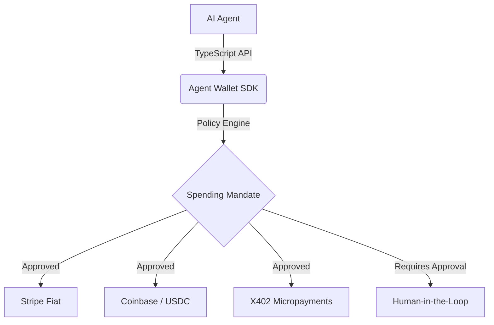

# agent-wallet-sdk

<div align="center">
  
  
  
</div>


> Banken sind für Menschen gemacht. Agenten brauchen ihre eigene Finanzinfrastruktur.

Passwörter, Gesichtserkennung, Personalausweise — alles für Menschen. KI-Agenten brauchen programmatische Wallets mit Spending-Limits, Session-Keys und kryptographischer Identität. 

Das **Agent Wallet SDK** ist die Unified Payment Infrastructure für autonome KI-Agenten. Es abstrahiert multiple Payment-Rails hinter einem einheitlichen TypeScript-Interface und stattet Agenten mit einer "Know Your Agent" (KYA) Identität sowie einer deklarativen Spending-Policy-Engine aus.

## The Problem

KI-Agenten können Code schreiben, E-Mails beantworten und Software bedienen. Aber wenn es darum geht, für eine API zu bezahlen oder eine Rechnung zu begleichen, scheitern sie am Login-Screen der Bank. Bisherige Workarounds (dem Agenten eine Kreditkarte geben) sind ein massives Sicherheitsrisiko.

## The Solution

Wir geben Agenten eigene Wallets, limitiert durch kryptographisch durchsetzbare Policies. 

### Multi-Rail Architecture



### Protocol Comparison

| Feature | X402 | Stripe MPP | Coinbase AgentKit | AP2 (Google/FIDO) |
|---------|------|------------|-------------------|-------------------|
| **Asset** | USDC / Lightning | Fiat (USD/EUR) | USDC / Crypto | Fiat / Token |
| **Auth** | HTTP Headers | Session Keys | Smart Contract | Cart Mandates |
| **Best For** | APIs, Micro-services | E-Commerce | DeFi, On-Chain | Enterprise B2B |
| **SDK Support** | ✅ Native | ✅ Wrapper | ✅ Wrapper | 🚧 Planned |

## Usage

```typescript
import { PolicyEngine } from '@agent-wallet-sdk/core';
import { StripeAgentWallet } from '@agent-wallet-sdk/stripe';

// 1. Load Policy
const policy = PolicyEngine.fromFile('./policies/procurement.yaml');

// 2. Initialize Wallet with Identity
const wallet = new StripeAgentWallet('wallet-123', agentIdentity, process.env.STRIPE_KEY);

// 3. Evaluate Transaction
const auth = policy.evaluateTransaction(450, 'EUR', 'software');

if (auth.allowed && !auth.requires_approval) {
  const result = await wallet.pay({
    amount: 450,
    currency: 'EUR',
    recipient: 'github-copilot',
    description: 'Monthly seat license'
  });
  console.log('Payment successful:', result.transaction_id);
}
```

## Policy Examples

Policies definieren in klarem YAML, was der Agent ausgeben darf.

```yaml
# policies/conservative.yaml
name: Conservative
description: "Konservative Ausgabenpolitik für vorsichtige Unternehmen"
rules:
  max_per_transaction: 50
  max_per_day: 200
  currency: EUR
  require_approval_above: 20
  blocked_categories:
    - gambling
```


## 🚀 Quantum Leap Architecture: TEE & MPC Enclaves

Private Keys im RAM eines Node.js-Prozesses sind inakzeptabel.
- **Trusted Execution Environments:** Keys leben in AWS Nitro Enclaves oder Apple Secure Enclaves.
- **Multi-Party Computation (MPC):** Der Agent hält nur einen Key-Share.
- **ZKP (Zero-Knowledge Proofs):** Der Agent beweist Bonität, ohne Kontostände zu leaken. Determinismus durch strikte Idempotency-Keys.


---

**Teil des Agentic Commerce Stack von Matteo Ise:**

- [well-known-mcp](https://github.com/matteo-ise/well-known-mcp) — Discovery-Standard für KI-Agenten
- [agent-wallet-sdk](https://github.com/matteo-ise/agent-wallet-sdk) — Unified Payment Infrastructure für Agenten
- [agent-governance](https://github.com/matteo-ise/agent-governance) — Audit, Compliance & Human-Escalation
- [mcp-deutschland](https://github.com/matteo-ise/mcp-deutschland) — MCP-Server für ELSTER, DATEV, XRechnung
- [mcp-handelsregister](https://github.com/matteo-ise/mcp-handelsregister) — Deutsches Handelsregister für Agenten
- [agentic-commerce-sdk](https://github.com/matteo-ise/agentic-commerce-sdk) — Agent-to-Agent Commerce
- [agentic-maturity-model](https://github.com/matteo-ise/agentic-maturity-model) — Reifegrad-Framework (Stufe 0→5)
- [kontorstack](https://github.com/matteo-ise/kontorstack) — Full-Stack Framework für agentische Unternehmen

[Matteo Ise auf GitHub](https://github.com/matteo-ise) · [X/Twitter](https://x.com/matteoise)
